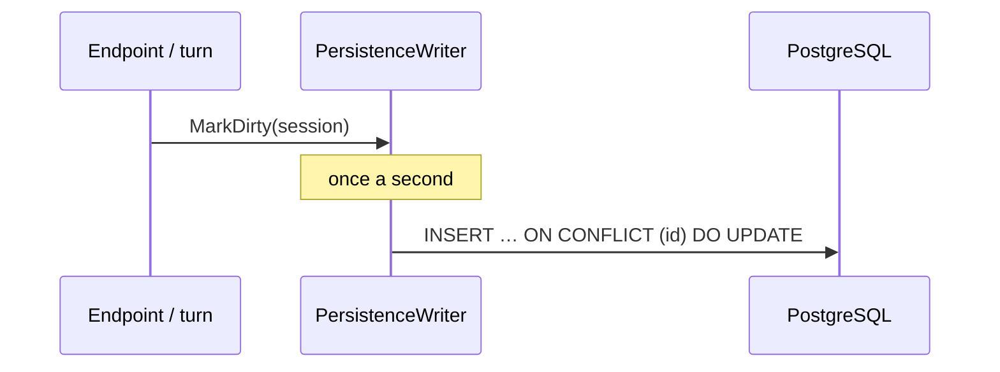

# Persistence

Persistence is optional and deliberately simple: a JSON snapshot per session in one PostgreSQL table, written behind the session's back, read as history. It follows the pattern proven in CopilotScope — `jsonb` snapshots with graceful degradation to memory-only. Source: [`Persistence/SessionRepository.cs`](https://github.com/konradcinkusz/agent-helm/blob/master/src/AgentHelm.Bridge/Persistence/SessionRepository.cs).

## Enabling it

Persistence is switched on by the connection string `ConnectionStrings:helmdb`. Without it, no repository is registered and the Bridge is memory-only. Aspire injects the connection string automatically; the compose files set it for their PostgreSQL service.

## Schema

The Bridge creates its table on startup if it does not exist:

```sql
CREATE TABLE IF NOT EXISTS helm_sessions (
    id            text PRIMARY KEY,
    agent_id      text NOT NULL,
    title         text NOT NULL,
    snapshot      jsonb NOT NULL,
    last_activity timestamptz NOT NULL
);
```

There are no migrations; the snapshot's JSON carries everything else.

## Snapshot format

`snapshot` is a serialised `ArchivedSession`:

```json
{
  "Id": "0a28b56cf207",
  "AgentId": "echo",
  "Cwd": "/home/dev/projects/acme-api",
  "Title": "Tidy up order_total",
  "CreatedAt": "2026-09-22T19:15:02.1+00:00",
  "LastActivity": "2026-09-22T19:15:09.8+00:00",
  "Transcript": [
    { "Time": "…", "Role": "user", "Text": "Hello!", "Kind": "message" }
  ],
  "NativeSessionId": "echo-4821"
}
```

`NativeSessionId` — the agent's own session id — is what makes [resume](../guide/history.md#resuming-a-session) possible; rows written before it existed have none.

## Write-behind



`PersistenceWriter` is a hosted background service. Code that changes a session calls `MarkDirty` — at the end of every turn, after a permission decision, a rename, a policy change, a git accept or reject, and on the source session of a handoff. Once a second the writer upserts every dirty session. Repeated changes within that second cost one write.

If a write fails, it is logged at `Debug` and retried the next time that session changes.

## Degradation

| Situation | Behaviour |
|---|---|
| No `helmdb` connection string | memory-only; `/api/history` returns `[]`; resume answers *Persistence is not configured* |
| PostgreSQL unreachable at startup | warning *Postgres unavailable — running memory-only. History will not survive restarts.*; the writer stops for this run |
| History query fails | `/api/history` returns `[]` rather than an error |
| A row cannot be deserialised | skipped, the rest still load |

## Reads and deletes

- `GET /api/history` returns the snapshots of the 200 most recently active sessions.
- Resume loads a single snapshot by id.
- `DELETE /api/sessions/{id}` deletes the row along with the live session.

## Not persisted

Agent processes (they cannot be rehydrated — a restarted Bridge offers history and resume, not the old process), pending permission requests, terminal output, the agent's "thinking" stream, tool status updates, and the runtime CopilotScope URL.

## Looking at the data

With Aspire, open pgAdmin from the dashboard. With the compose files:

```bash
docker compose exec postgres psql -U helm -d helmdb \
  -c "SELECT id, agent_id, title, last_activity FROM helm_sessions ORDER BY last_activity DESC;"
```

## Aspire and the database password

Aspire generates the PostgreSQL password and, because the AppHost has a `UserSecretsId`, stores it in user secrets so that it matches the persistent volume `agenthelm-pgdata` on the next run. A volume initialised with a different password produces *password authentication failed* — see [Troubleshooting](../project/troubleshooting.md#postgresql-password-authentication-failed-under-aspire).
