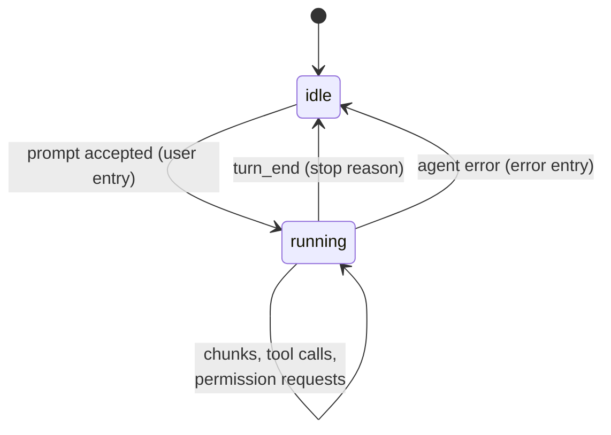

# Sessions & events

`HelmSession` ([`Sessions/SessionManager.cs`](https://github.com/konradcinkusz/agent-helm/blob/master/src/AgentHelm.Bridge/Sessions/SessionManager.cs)) is the unit everything else hangs off: one agent adapter, one transcript, one policy, and any number of live subscribers.

## Creating a session

`SessionManager.CreateAsync(agentId, cwd, title, policy, resumeNativeSessionId, model)`:

1. looks the agent up in the catalog — unknown ids are an `ArgumentException` (HTTP 400);
2. checks that `cwd` exists on the Bridge's file system — otherwise another `ArgumentException`;
3. builds the adapter through the [factory](adapters.md#the-adapter-factory);
4. creates the `HelmSession` — a 12-character hex id, the default title `<agent name> · <folder>`, the requested policy if valid;
5. wires the adapter's events and permission handler to the session, **then** starts the adapter (so a resume replay is captured);
6. registers the session.

If the adapter fails to start, the session is not registered and the caller gets the error.

## State

| Property | Values |
|---|---|
| `Status` | `idle` or `running` |
| `Policy` | `ask`, `auto_read`, `yolo` — see [Permissions & policies](../guide/permissions.md) |
| `Pending` | the permission request waiting for a human, or none |
| `CreatedAt`, `LastActivity` | UTC timestamps; `LastActivity` moves with every agent event |
| `Title` | 1–120 characters |

## A turn

`RunPromptAsync` appends the `user` entry (with attachment names), sets `running`, awaits the adapter's `PromptAsync`, then flushes any buffered text, publishes `turn_end` and returns to `idle`. An exception becomes a `system` entry *Agent error: …* instead of escaping.

**Streaming.** `assistant_chunk` events are published live as `chunk` and appended to a buffer. The buffer is flushed into a single `assistant` entry when a tool call arrives or the turn ends, so the transcript holds readable messages rather than fragments.

**Permission wait.** A request the policy does not decide becomes `Pending`, is announced as a `permission` event with a `Permission requested` entry, and parks the agent's request on a `TaskCompletionSource`. `POST …/permission` completes it; deleting the session completes it with a denial. Automatic decisions never become `Pending`; they are only audited.

## The transcript

An append-only list of `ChatEntry(Time, Role, Text, Kind)`, guarded by a lock and copied on read. Roles are `user`, `assistant`, `tool` and `system`; the kinds and the exact audit texts are listed in [Events & transcript](../reference/events.md). The same entries are what [persistence](persistence.md) stores.

## Live events

Every change is also published as a `SessionEventDto(Kind, Text, Data)`:

- each subscriber — each open SSE connection — gets its own **unbounded channel**, so a slow reader never blocks the agent or other readers;
- `GET /api/sessions/{id}/stream` writes each event as one `data:` line of JSON;
- unsubscribing (the client disconnects) completes that channel.

Every transcript append is published as an `entry` event carrying the entry, so a client that loaded the transcript once can follow along from the stream alone. The other kinds — `chunk`, `status`, `permission`, `permission_resolved`, `title`, `policy`, `turn_end`, `tool_update` and pass-through kinds — are listed in [Events & transcript](../reference/events.md#live-events).

The Web UI loads the session once (`GET /api/sessions/{id}`), then applies events from the stream; the session list in the rail is polled every three seconds.

## Removing a session

`SessionManager.Remove` disposes the session: pending permission waits are completed as denials, subscriber channels are completed, and the adapter is disposed, which kills the agent's process tree. The `DELETE` endpoint also stops the session's terminal and deletes its history row.
