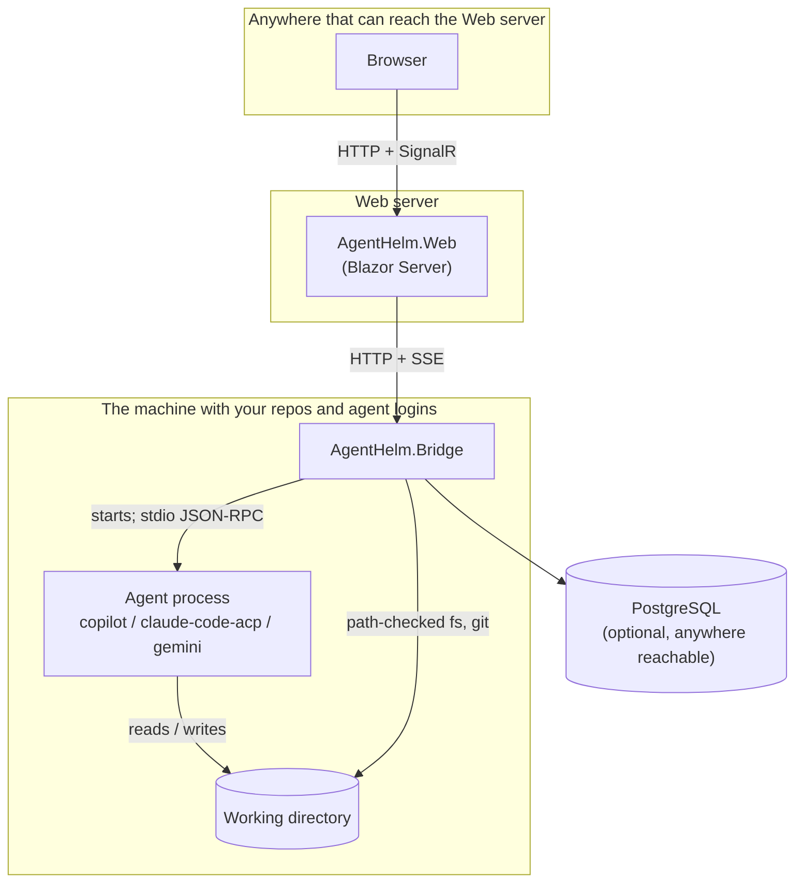

# Deployment & topology

AgentHelm has three moving parts — the **Web UI**, the **Bridge** and the **agents** — plus your **repositories** and an optional **database**. This page explains which of them must be on the same machine, and what that means for containers and remote setups.

## The one rule

> **The Bridge, the agent CLIs (with their logins) and the repositories must be on the same machine.**



Why:

- **Agents are child processes of the Bridge.** ACP agents talk over standard input and output; the protocol's remote transport is still at the proposal stage. The Bridge must be able to start the agent binary itself.
- **Agents use their local login.** The Copilot CLI, Claude Code and Gemini CLI read credentials from the home directory of the user running them. A Bridge on another machine — or in a container — does not have them.
- **The working directory is a path on the Bridge's machine.** When a session starts, the Bridge checks that the directory exists *on its own file system*, starts the agent there, and sends the same path to the agent in `session/new`.

What can be elsewhere:

- **The browser.** It talks only to the Web server.
- **The Web server**, as long as it can reach the Bridge over HTTP. The Web UI is a Blazor Server application: the Web *server* makes all calls to the Bridge; the browser never does.
- **PostgreSQL**, anywhere the Bridge can reach.

## Supported setups

| Setup | Bridge | Real agents | Notes |
|---|---|:---:|---|
| **All local** — release zip, `dotnet run`, Aspire | your machine | :material-check: | Recommended. Everything on loopback. |
| **Containers** — Docker Compose | container | echo only | Good for trying the UI and the permission flow. Repositories must be mounted. |
| **Remote Bridge** | another machine | on that machine | Not supported out of the box; see [Exposing the Bridge](#exposing-the-bridge). |

## Working directories

The path you type into **Working directory** is always interpreted by the **Bridge**:

| Your setup | You see the folder at | Enter in the form |
|---|---|---|
| Bridge on your machine | `C:\Repos\myrepo` | `C:\Repos\myrepo` |
| Bridge in Docker with `- C:\Repos:/repos` | `C:\Repos\myrepo` | `/repos/myrepo` — the container path |
| Bridge on a server | a local folder (not usable) | the path on the server |

The 📁 button in the form browses the **Bridge's** file system. In Chromium-based browsers it first opens your operating system's folder picker, but a browser only tells a web page the picked folder's *name*, never its full path — so AgentHelm uses that name as a hint (*Local: myrepo — navigate to where this folder is mounted on the Bridge server*) and lets you find the matching directory on the Bridge's side.

## Containers

The Bridge image ([`Dockerfile`](https://github.com/konradcinkusz/agent-helm/blob/master/Dockerfile)) contains the Bridge and the echo agent, and nothing else: no Copilot CLI, no Node.js, no Gemini CLI, and none of your logins. To let container sessions work in your repositories, mount them:

```yaml
services:
  bridge:
    volumes:
      - /home/you/repos:/repos      # Linux / macOS
      # - C:\Repos:/repos           # Windows
```

…and use `/repos/<name>` as the working directory. The Terminal tab then operates on the mounted files as the container's user. The image is based on the plain ASP.NET Core runtime image, which has no `git`, so the Changes tab reports every directory as *not a git repository* inside the container.

Building your own image that also contains an agent CLI is possible, but you then own its installation, its credentials inside the container and their protection.

## Exposing the Bridge

By default the Bridge listens on `127.0.0.1:5199` only. It executes agent tools, runs shell commands in the Terminal tab and reads and writes files in working directories, so **anything that can reach the Bridge can do all of that as the user running it**. Before changing `AgentHelm:Urls` to anything but loopback:

1. Set a strong `AgentHelm:ApiToken` (and the same value as `Bridge:ApiToken` on the Web UI).
2. Put the Bridge — and the Web UI — behind a reverse proxy with TLS and real authentication; the shared token is a speed bump, not an identity system.
3. Restrict the listening address to the network that needs it; never expose it to the internet.
4. Keep the permission policy at `ask`.

The [security model](../security/index.md) lists the boundaries the Bridge holds and those it does not.

## Alternatives that are not built in

- **A remote Bridge with local agents** would need a tunnel (SSH, for example) from the Bridge to the agents, or an ACP remote transport; neither exists in AgentHelm today.
- **The GitHub Copilot SDK adapter** could talk to a shared `copilot --headless --port` server instead of spawning the CLI, but it is still a skeleton — see [Agent adapters](../architecture/adapters.md#the-copilot-sdk-adapter).
