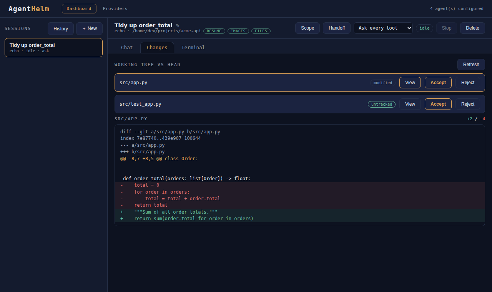

# Reviewing changes

The **Changes** tab turns the working directory's uncommitted changes into a review queue: see what the agent changed, file by file, and keep or undo each change. It works in any session whose working directory is inside a git repository, with `git` on the Bridge's `PATH`.

{ loading=lazy }

## The file list

Opening the tab (or clicking **Refresh**) lists every change in the working tree compared to `HEAD`, from `git status --porcelain`:

| Status | Meaning |
|---|---|
| `modified` | tracked file changed |
| `added` | new file staged |
| `deleted` | tracked file removed |
| `renamed` / `copied` | detected rename or copy (the new path is shown) |
| `typechange` | e.g. a file became a symlink |
| `untracked` | new file git does not know yet |

The list shows all uncommitted changes in the repository — including your own edits, not only the agent's. If the directory is not a git repository the tab says so; a clean tree shows *Working tree clean — nothing to review*.

## Viewing a diff

**View** shows the file's diff against `HEAD` (`git diff HEAD -- <path>`) with added and removed line counts. Untracked files have no diff, so AgentHelm shows their whole content as added lines.

## Accept

**Accept** stages the file: `git add -- <path>`. The change stays in your working tree and is marked as reviewed in git's index; nothing is committed. The transcript records *Accepted (staged) changes: `<path>`*.

Commit when you are ready — from the [Terminal](terminal.md) tab or your usual tools.

## Reject

**Reject** asks for confirmation (**Confirm revert**), then makes the change not have happened:

- a **tracked** file is restored from `HEAD` with `git checkout HEAD -- <path>` — this discards both staged and unstaged changes to that file;
- an **untracked** file is deleted.

The transcript records *Rejected (reverted) changes: `<path>`*.

> [!CAUTION]
> Reject cannot be undone, and it does not know who made a change: your own uncommitted edits to the same file are discarded too. Commit or stash anything you want to keep first.

Whether a file is tracked or untracked is worked out again by the Bridge at the moment you reject — it is never taken from the browser's request, because the difference between *revert* and *delete* is not something to trust a client with.

## Guard rails

- Every path is resolved against the session's working directory, and anything that points outside it — `../../etc/passwd`, or a symbolic link whose target lies outside — is refused with *Path escapes the session working directory*.
- Accept and reject are audited like permission decisions, so the transcript shows what was kept and what was undone.
- The tab runs the ordinary `git` executable: repository hooks, `.gitignore` and your git configuration apply as usual.

## Tips

- Review in small steps: ask the agent for one change, review it, accept it, then ask for the next. Staged changes are easy to tell apart from new ones with `git diff` (unstaged) and `git diff --staged` in the terminal.
- To throw away *everything* the agent did, reject file by file, or use `git checkout -- .` / `git clean` in the terminal if you know exactly what you are doing.
