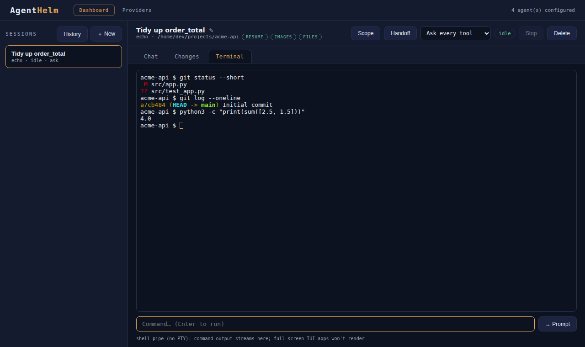

# Terminal

The **Terminal** tab is a shell next to the conversation, running in the session's working directory: build, run the tests, inspect git, and pass the output to the agent with one click.

{ loading=lazy }

## How it works

- The shell starts the first time you open the tab, one per session, **in the working directory and as the user running the Bridge**.
- Type a command in the input box under the terminal and press ++enter++; the output streams into the terminal view (rendered by [xterm.js](https://xtermjs.org/), so colours and ANSI escape sequences display).
- Switching tabs does not stop the shell. When you come back, the recent output is replayed (the Bridge keeps the last 64,000 characters).
- If the shell exits (you typed `exit`), a fresh one starts the next time you open the tab.
- Deleting the session stops its shell.

## PTY mode and pipe mode

| | PTY mode | Pipe mode |
|---|---|---|
| When | a `script` at `/usr/bin/script` or `/bin/script` that identifies itself as util-linux's — i.e. Linux | Windows (`cmd.exe`); macOS, BusyBox and other systems without util-linux `script` (`/bin/bash`) |
| How | `script -qfe -c /bin/bash /dev/null`, `TERM=xterm-256color` | the shell's standard streams directly |
| Programs see | a real terminal (`isatty` is true) | a pipe |
| Colours, prompts, line editing | work | many tools switch colours off |
| Echo of your command | by the terminal itself | added by the UI |
| Hint under the terminal | *PTY: prompts, colours and line editing work…* | *shell pipe (no PTY)…* |

> [!NOTE]
> macOS and BusyBox also ship a `script`, but not util-linux's: it rejects the options above. The Bridge asks the binary for its version once and uses PTY mode only for util-linux, so on those systems the terminal runs in pipe mode rather than failing to start.

Even in PTY mode, input is sent **a line at a time** from the input box. Full-screen programs (`vim`, `htop`, `less`) therefore cannot be used, and there is no way to send ++ctrl+c++ — a command that never finishes keeps the shell busy until you delete the session. Prefer commands that exit on their own (for example `git --no-pager log`, `pytest -x`).

## Sending output to the agent

**→ Prompt** takes the last 2,000 characters of terminal output and appends them to the chat composer as a fenced block under *Terminal output:*, then switches to the Chat tab. Add your question — *"Why does this test fail?"* — and send. Nothing is sent until you press **Send**.

## Security

The terminal runs arbitrary commands **as you, on your machine** — exactly as powerful as your own terminal, because it is one. It is protected by the same loopback bind and optional `x-helm-token` as the rest of the Bridge, which is one more reason to [enable the token](../security/index.md#hardening-checklist) if anything but your own browser can reach the Bridge.
