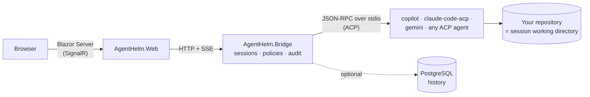

# AgentHelm documentation

<strong>A web cockpit for AI coding agents.</strong> One browser UI to drive GitHub Copilot CLI, Claude Code, Gemini CLI and any other agent that speaks the <a href="https://agentclientprotocol.com">Agent Client Protocol</a> — with a live transcript, explicit tool permissions and an audit trail of every decision.

This wiki is the project's documentation: how to install and use AgentHelm, how to configure and deploy it, how it is built, and how to work on it. Every page has an **edit** button — improvements are welcome as pull requests.

-   :material-rocket-launch-outline:{ .lg .middle } **Getting started**

    ---

    Install AgentHelm and run a first session with the built-in echo agent — no real agent needed.

    [:octicons-arrow-right-24: Installation](getting-started/installation.md)

-   :material-steering:{ .lg .middle } **User guide**

    ---

    Sessions, permission policies, reviewing changes, the terminal, handoff, history and resume.

    [:octicons-arrow-right-24: The interface](guide/index.md)

-   :material-tune-variant:{ .lg .middle } **Configuration**

    ---

    Every setting, the agent catalog, and where the Bridge and the UI can run.

    [:octicons-arrow-right-24: Configuration reference](configuration/index.md)

-   :material-sitemap-outline:{ .lg .middle } **Architecture**

    ---

    Components, the ACP client, the adapter seam, sessions and persistence — and the reasons behind them.

    [:octicons-arrow-right-24: Architecture overview](architecture/index.md)

-   :material-api:{ .lg .middle } **Reference**

    ---

    The Bridge HTTP API, the live event stream, transcript entries and a glossary.

    [:octicons-arrow-right-24: Bridge HTTP API](reference/http-api.md)

-   :material-shield-lock-outline:{ .lg .middle } **Security**

    ---

    The boundaries AgentHelm holds, how to harden a deployment, and how to report a vulnerability.

    [:octicons-arrow-right-24: Security model](security/index.md)

-   :material-source-pull:{ .lg .middle } **Development**

    ---

    Dev setup, project layout, tests, CI/CD, releases — and how to edit this wiki.

    [:octicons-arrow-right-24: Development guide](development/index.md)

-   :material-map-marker-path:{ .lg .middle } **Project**

    ---

    Roadmap, troubleshooting & FAQ, and the background behind the project.

    [:octicons-arrow-right-24: Roadmap](project/roadmap.md)

## At a glance

| Topic | Summary |
|---|---|
| **What it is** | A local control plane for coding agents: sessions, streamed chat, a permission gateway with policies and an audit trail, git review, a terminal, agent handoff, history and resume. |
| **Agents** | GitHub Copilot CLI, Claude Code and Gemini CLI are preconfigured; any ACP agent can be added as a configuration entry; a built-in echo agent needs nothing installed. |
| **Stack** | .NET 8 — ASP.NET Core minimal API (the Bridge), Blazor Server (the web UI), .NET Aspire for local orchestration, optional PostgreSQL for history. |
| **Where it runs** | On your machine, next to your repositories and your agents. The Bridge listens on `127.0.0.1` by default. |
| **Status** | Milestones M0–M3 and the post-M3 hardening roadmap are complete — see the [roadmap](project/roadmap.md). |
| **License** | MIT |

## How it fits together

The **Bridge** is the heart of the system: it starts each agent as a child process, speaks ACP to it, decides every permission request under the session's policy, records everything in the transcript and streams it to the **Web** UI. The [architecture overview](architecture/index.md) walks through it.

## Where to start

- **"I want to try it."** → [Installation](getting-started/installation.md), then [your first session](getting-started/first-session.md).
- **"I want to use it with my agent."** → [Connecting agents](getting-started/agents.md) and the [agent catalog](configuration/agent-catalog.md).
- **"I want to know what it can do to my machine."** → [Security model](security/index.md) and [permissions & policies](guide/permissions.md).
- **"I want to build on it or contribute."** → [Architecture](architecture/index.md), the [HTTP API](reference/http-api.md) and the [development guide](development/index.md).

> [!NOTE]
> AgentHelm has a sibling project, [CopilotScope](https://github.com/konradcinkusz/copilotscope). *Scope observes* — what was that session worth? *Helm steers* — run the session, approve the tools, keep the record. See [CopilotScope integration](guide/copilotscope.md).
