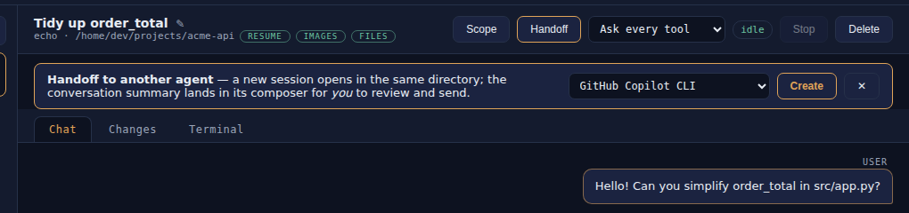

**Handoff** continues a conversation with a different agent: a second opinion from another model, a switch to an agent that is better at the task, or simply carrying on when one agent's quota runs out. AgentHelm opens a new session in the same directory and gives the new agent a summary of the conversation so far — for you to review before anything is sent.



## How to hand off

1. In the session header, click **Handoff**.
2. Pick the target agent. The list preselects the first agent that differs from the current one, but any agent — including the same one — is allowed.
3. Click **Create**.

AgentHelm then:

- starts a **new session** with the target agent, in the **same working directory**, with the **same permission policy**, titled `<agent id> · handoff`;
- switches to it and **prefills its composer** with the handoff summary;
- adds an audit entry to the **source** session: *Handoff to '`<agent>`' → session `<id>`*.

Read the summary, edit or shorten it if you like, add what you want the new agent to do, and press **Send**.

> **Important:** The summary is **never sent automatically**. You see exactly what the next agent will read, and nothing leaves AgentHelm until you press Send.

## What the summary contains

```text
[Handoff] You are taking over an ongoing coding session previously handled by agent 'copilot' in /home/dev/projects/acme-api.
Conversation so far (most recent last):
user: Can you simplify order_total in src/app.py?
assistant: …
tool: edit src/app.py
Please continue from here.
```

- It names the previous agent and the working directory.
- It lists the conversation as `role: text` lines — your prompts, the agent's replies and the titles of its tool calls. Audit entries (permissions, policy, git) are left out.
- It is limited to the **last 4,000 characters** of that conversation. Longer conversations are trimmed from the front and marked *[…earlier conversation trimmed…]* — the most recent context wins.

The new agent receives this as ordinary prompt text. It does not inherit the previous agent's internal state, memory or tool results beyond what the summary says.

## After the handoff

The source session stays open, with its agent still running, so you can compare answers or switch back. Delete it when you no longer need it. Both sessions work in the same directory, so avoid letting two agents edit the same files at the same time.
