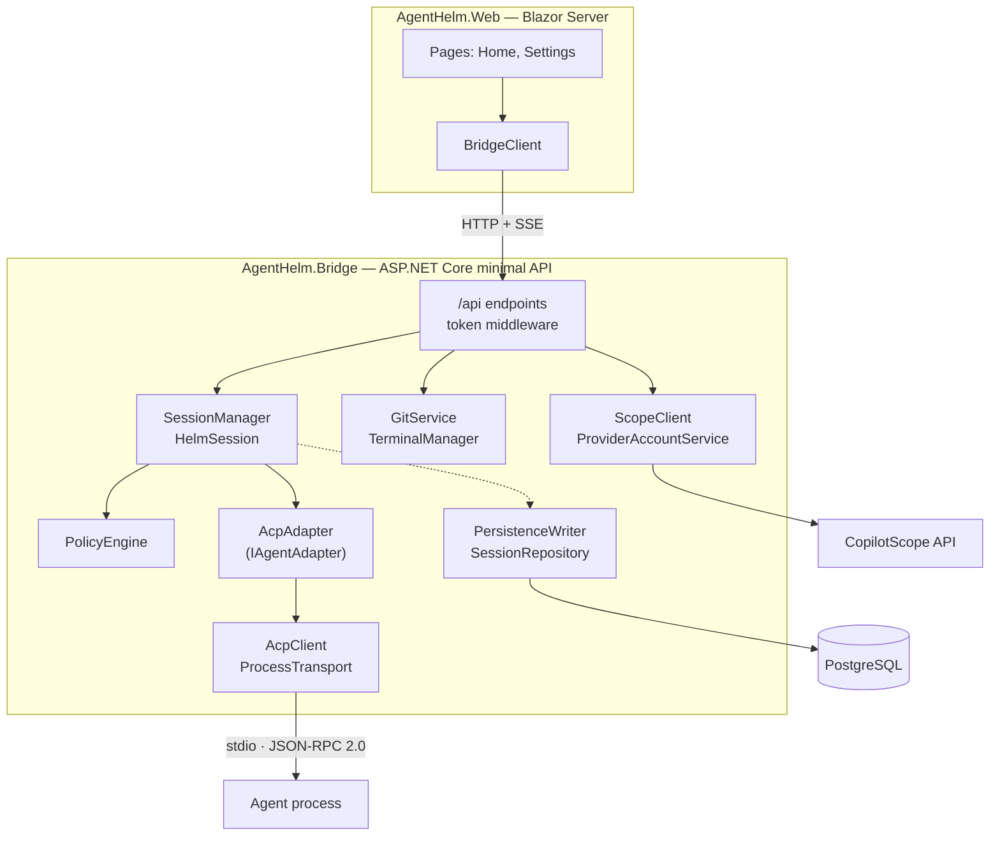
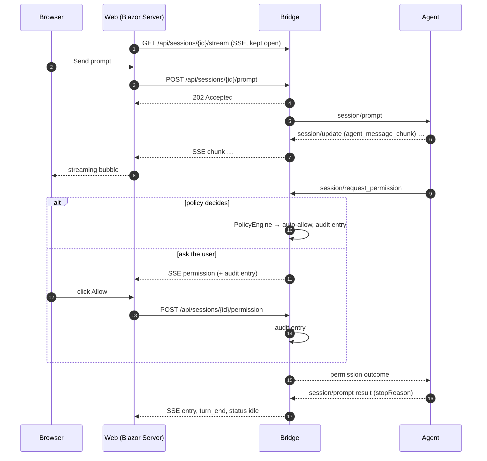

AgentHelm is a small .NET 8 solution. One process, the **Bridge**, does almost all the work: it owns sessions, runs agents, decides permissions and keeps the transcript. The **Web** UI renders it. Everything else supports those two.

## Projects

| Project | Path | Role |
|---|---|---|
| **AgentHelm.Bridge** | `src/AgentHelm.Bridge` | ASP.NET Core minimal API: sessions, agents, permission policies, git, terminal, persistence, integrations. Its only NuGet dependency is Npgsql. |
| **AgentHelm.Web** | `src/AgentHelm.Web` | Blazor Server UI (interactive server render mode). `BridgeClient` is its only way to the Bridge; xterm.js renders the terminal. |
| **AgentHelm.AppHost** | `src/AgentHelm.AppHost` | .NET Aspire orchestration for development: PostgreSQL container, Bridge and Web as local processes. |
| **AgentHelm.EchoAgent** | `tools/AgentHelm.EchoAgent` | A minimal ACP agent for demos and manual testing. |
| **AgentHelm.Tests** | `tests/AgentHelm.Tests` | xUnit tests for the Bridge — see [Testing](Testing.md). |

## Inside the Bridge

| Component | Source | Responsibility |
|---|---|---|
| Endpoints | `Program.cs` | The [HTTP API](Bridge-HTTP-API.md), the optional `x-helm-token` middleware, the loopback default. |
| `AgentCatalog` | `Sessions/SessionManager.cs` | The configured agents (`AgentHelm:Agents`). |
| `SessionManager`, `HelmSession` | `Sessions/SessionManager.cs` | Creating, finding and removing sessions; each session's transcript, status, policy, pending permission and live event fan-out. See [Sessions & events](Sessions-and-Events.md). |
| `IAgentAdapter`, `AcpAdapter` | `Sessions/SessionManager.cs` | The seam between sessions and agent protocols. See [Agent adapters](Agent-Adapters.md). |
| `AcpClient`, `ProcessTransport` | `Agents/Acp/AcpClient.cs` | The ACP client and the child-process transport, including the working-directory path guard. See [Agent Client Protocol](Agent-Client-Protocol.md). |
| `CopilotSdkAdapter` | `Agents/CopilotSdk/CopilotSdkAdapter.cs` | Skeleton of a GitHub Copilot SDK adapter, compiled only with `COPILOT_SDK`. |
| `PolicyEngine` | `Sessions/PermissionPolicy.cs` | Pure function deciding permission requests under `ask` / `auto_read` / `yolo`. See [Permissions & policies](Permissions-and-Policies.md). |
| `PathGuard` | `Security/PathGuard.cs` | The working-directory rule shared by the ACP file requests and the git endpoints — checked as written and after following symbolic links. |
| `GitService` | `Workbench/GitService.cs` | Changes, diffs, accept and reject via the `git` CLI, with the same path guard. |
| `TerminalManager` | `Workbench/TerminalService.cs` | One shell per session, PTY through `script(1)` where available. |
| `ScopeClient` | `Integrations/ScopeClient.cs` | CopilotScope API client and time-window correlation. |
| `ProviderAccountService` | `Providers/ProviderAccountService.cs` | Account status of the agent CLIs, login/logout processes, Copilot models. |
| `SessionRepository`, `PersistenceWriter` | `Persistence/SessionRepository.cs` | PostgreSQL snapshots with a one-second write-behind. See [Persistence](Persistence.md). |

## A prompt, end to end

1. When a session is opened, the Web server subscribes to its event stream. Your browser only ever talks to the Web server (SignalR); the Web server talks to the Bridge.
2. `POST …/prompt` returns `202` at once; the turn runs in the background on the Bridge. A second prompt while a turn is running gets `409`.
3. Streamed text is published as `chunk` events and buffered; it becomes one `assistant` transcript entry when a tool call arrives or the turn ends.
4. A permission request blocks the agent's turn until it is decided — by the `PolicyEngine`, or by you through the API.

## State and lifetime

- **Live state is in memory.** Sessions, transcripts, pending permissions, terminals and subscriptions live in the Bridge process. Agents and shells are its child processes.
- **Durable state is optional.** With PostgreSQL, a snapshot of each changed session is written about a second after the change; after a restart, snapshots are read-only history that can be resumed. See [Persistence](Persistence.md).
- **Fan-out is per subscriber.** Each SSE connection gets its own unbounded channel; slow readers never block the session.
- **One turn at a time** per session; any number of sessions in parallel.

## Why it looks like this

The [design decisions](Design-Decisions.md) page records the reasoning: protocol over plugins, the adapter seam, a local Bridge, the security boundary in the Bridge rather than the UI, policies that can only allow, minimal dependencies, and more.
