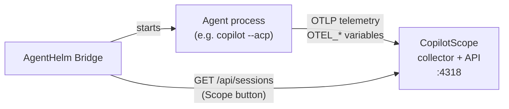

[CopilotScope](https://github.com/konradcinkusz/copilotscope) is AgentHelm's sibling project: a local collector that turns an agent's OpenTelemetry export into a per-session **quality score**. The two are designed as a pair — *Scope observes* (was that session worth the tokens?), *Helm steers* (run the session, approve the tools, keep the record) — and meet in two places.

## 1. Agents export telemetry to Scope

The Bridge starts every agent with the environment variables from its [catalog entry](Agent-Catalog.md). The preconfigured `copilot` entry switches on Copilot's OpenTelemetry export and points it at a local collector:

| Variable | Value |
|---|---|
| `COPILOT_OTEL_ENABLED` | `true` |
| `COPILOT_OTEL_EXPORTER_TYPE` | `otlp-http` |
| `OTEL_EXPORTER_OTLP_ENDPOINT` | `http://localhost:4318` |
| `OTEL_EXPORTER_OTLP_PROTOCOL` (and the `_TRACES_`, `_METRICS_`, `_LOGS_` variants) | `http/protobuf` |
| `OTEL_EXPORTER_OTLP_HEADERS` | `x-api-key=dev-secret-123` |
| `OTEL_INSTRUMENTATION_GENAI_CAPTURE_MESSAGE_CONTENT` | `true` |

The release-zip launchers export the same set for every process they start; override `OTEL_EXPORTER_OTLP_ENDPOINT` and `OTEL_EXPORTER_OTLP_HEADERS` in your shell to change them.

> **Warning:** `OTEL_INSTRUMENTATION_GENAI_CAPTURE_MESSAGE_CONTENT=true` puts **prompt and response content** into the telemetry. That is what lets CopilotScope judge a session, and it is harmless while the endpoint is a collector on your own machine. If you point the endpoint anywhere else, your conversations — and any code in them — go there too. Remove the variable if that is not what you want.

## 2. Scope scores inside AgentHelm

Click **Scope** in the session header. The Bridge asks CopilotScope for its recent sessions (`GET <Scope URL>/api/sessions`) and shows those whose last activity falls within this session's lifetime — from when it started to its last activity, with two minutes of slack on each side — newest first, at most three. For each match you see the score, the grade, the model and the confidence.

Once you have opened the panel, a session started without an explicit model shows the model of the newest matching Scope session in its header.

> **Note:** The match is **time-based and best-effort**. Scope identifies sessions by OpenTelemetry conversation ids that AgentHelm never sees, so it cannot know which Scope session is "this" one — it shows the ones that overlap in time and lets you judge. Several agents working at once will blur the picture. Exact correlation needs session tagging on the telemetry path, which is on the [roadmap](Roadmap.md) for both projects.

When CopilotScope is not running, the panel says so. After a failed request the Bridge stops asking for **60 seconds**, and each request gives up after **3 seconds**, so an absent Scope never makes AgentHelm slow.

## Configuration

| Where | What |
|---|---|
| `AgentHelm:Scope:BaseUrl` | Base URL of CopilotScope's API. Default `http://localhost:4318`. Set it to `disabled` to switch the integration off. |
| **⚙ Pre-config** in the new-session form | Shows the current Scope URL and changes it for the running Bridge (`POST /api/config/scope-url`) when you start the session. The change lasts until the Bridge restarts. |

> **Note:** Despite its *OTel endpoint* label, the Pre-config field only changes where the **Bridge reads scores from**. Where agents **send** telemetry is decided by the `OTEL_*` variables above. With CopilotScope both are the same address, which is why one field is enough in the usual setup.

CopilotScope's own documentation covers installing and running the collector.
