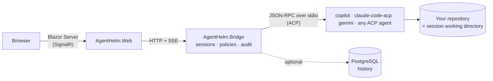

**AgentHelm is a web cockpit for AI coding agents.** One browser UI to drive GitHub Copilot CLI, Claude Code, Gemini CLI and any other agent that speaks the [Agent Client Protocol](https://agentclientprotocol.com) — with a live transcript, explicit tool permissions and an audit trail of every decision.

 

This wiki is the project's documentation: how to install and use AgentHelm, how to configure and deploy it, how it is built, and how to work on it. The sidebar lists every page. The pages are generated from the [`wiki/` folder](https://github.com/konradcinkusz/agent-helm/tree/master/wiki) of the repository, so improvements are welcome as pull requests — see [Editing the wiki](Editing-the-Wiki.md).

## Sections

| Section | What you find there |
|---|---|
| 🚀 [Getting started](Getting-Started.md) | Install AgentHelm and run a first session with the built-in echo agent — no real agent needed. |
| 🧭 [User guide](User-Guide.md) | Sessions, permission policies, reviewing changes, the terminal, handoff, history and resume. |
| ⚙️ [Configuration](Configuration.md) | Every setting, the agent catalog, and where the Bridge and the UI can run. |
| 🏗️ [Architecture](Architecture.md) | Components, the ACP client, the adapter seam, sessions and persistence — and the reasons behind them. |
| 📖 Reference | The [Bridge HTTP API](Bridge-HTTP-API.md), the [event stream and transcript entries](Events-and-Transcript.md), and a [glossary](Glossary.md). |
| 🛡️ [Security](Security.md) | The boundaries AgentHelm holds, how to harden a deployment, and how to report a vulnerability. |
| 🛠️ [Development](Development.md) | Dev setup, project layout, tests, CI/CD, releases — and how to edit this wiki. |
| 🗺️ Project | The [roadmap](Roadmap.md), [troubleshooting & FAQ](Troubleshooting-and-FAQ.md), and the [background](Background-and-Vision.md) behind the project. |

## At a glance

| Topic | Summary |
|---|---|
| **What it is** | A local control plane for coding agents: sessions, streamed chat, a permission gateway with policies and an audit trail, git review, a terminal, agent handoff, history and resume. |
| **Agents** | GitHub Copilot CLI, Claude Code and Gemini CLI are preconfigured; any ACP agent can be added as a configuration entry; a built-in echo agent needs nothing installed. |
| **Stack** | .NET 8 — ASP.NET Core minimal API (the Bridge), Blazor Server (the web UI), .NET Aspire for local orchestration, optional PostgreSQL for history. |
| **Where it runs** | On your machine, next to your repositories and your agents. The Bridge listens on `127.0.0.1` by default. |
| **Status** | Milestones M0–M3 and the post-M3 hardening roadmap are complete — see the [roadmap](Roadmap.md). |
| **License** | MIT |

## How it fits together

The **Bridge** is the heart of the system: it starts each agent as a child process, speaks ACP to it, decides every permission request under the session's policy, records everything in the transcript and streams it to the **Web** UI. The [architecture overview](Architecture.md) walks through it.

## Where to start

- **"I want to try it."** → [Installation](Installation.md), then [your first session](Your-First-Session.md).
- **"I want to use it with my agent."** → [Connecting agents](Connecting-Agents.md) and the [agent catalog](Agent-Catalog.md).
- **"I want to know what it can do to my machine."** → [Security](Security.md) and [permissions & policies](Permissions-and-Policies.md).
- **"I want to build on it or contribute."** → [Architecture](Architecture.md), the [HTTP API](Bridge-HTTP-API.md) and the [development guide](Development.md).

> **Note:** AgentHelm has a sibling project, [CopilotScope](https://github.com/konradcinkusz/copilotscope). *Scope observes* — what was that session worth? *Helm steers* — run the session, approve the tools, keep the record. See [CopilotScope integration](CopilotScope-Integration.md).
