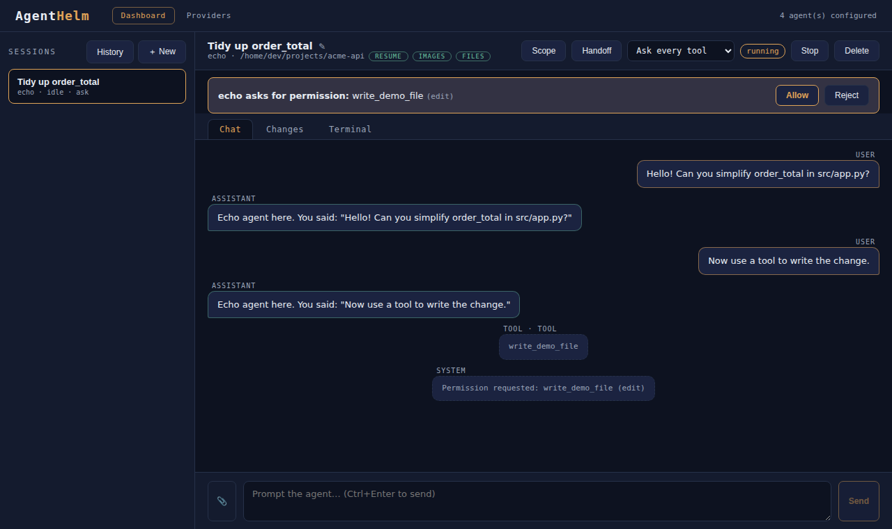
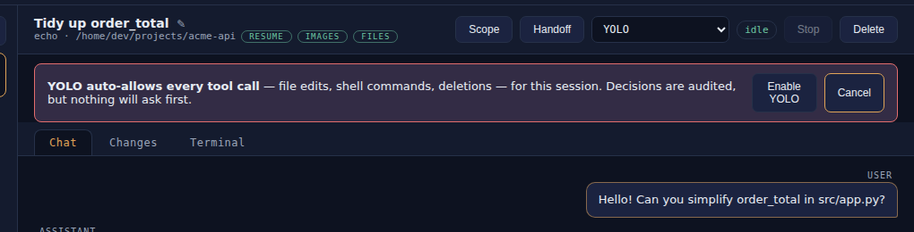

Before an ACP agent runs a tool — edits a file, runs a command, fetches a URL — it sends a **permission request** to its client. In AgentHelm that client is the Bridge, and every request goes through one place: the session's **permission policy**. The policy either answers automatically or puts the question to you. Either way, the decision is written to the transcript.

## The permission banner

A request that needs you appears as a banner above the tabs, naming the agent, the tool and its **kind**:

The buttons are exactly the options the agent offered, in the agent's words — typically *Allow*, *Allow always*, *Reject* and so on. Allow-type options are highlighted, reject-type options are red. While the banner is open, the agent's turn is paused and the session card in the rail shows `⏳ permission`.

When you click an allow option, AgentHelm passes that exact option back to the agent. When you click a reject option, AgentHelm answers with the first reject-type option in the agent's list; an agent that offered none gets a *cancelled* outcome.

## Policies

Each session has one policy, shown in the header drop-down. New sessions start with `ask`; a session created by [handoff](Agent-Handoff.md) inherits the policy of the session it came from.

| Policy | Drop-down label | Automatically allowed | Asks you |
|---|---|---|---|
| `ask` | Ask every tool | nothing | every request |
| `auto_read` | Auto-allow reads | tool kinds `read`, `search`, `think` | everything else, including `fetch` |
| `yolo` | YOLO | everything | nothing |

Changing the policy takes effect for the next request and is itself recorded in the transcript: *Permission policy changed to 'auto_read'*.

### Why `auto_read` does not include `fetch`

A `fetch` does not change anything on your machine, but it is a network call: it can carry out whatever a previous read just loaded — a key, a config file, source code. Auto-allowing reads *and* fetches would turn a read into a possible exfiltration without a single prompt, so `fetch` always asks.

### YOLO

YOLO allows every tool call without asking — file edits, shell commands, deletions. Selecting it never takes effect silently; AgentHelm first asks you to confirm:

YOLO is per session and never a default. Every decision it makes is still written to the transcript.

## Tool kinds

ACP agents classify each tool call with a **kind**. AgentHelm shows it in the banner and uses it for `auto_read`. The kinds ACP defines include:

| Kind | Typical tool | `auto_read` |
|---|---|:---:|
| `read` | read a file | allowed |
| `search` | search files or code | allowed |
| `think` | internal reasoning step | allowed |
| `edit` | modify a file | asks |
| `delete` | delete a file | asks |
| `move` | move or rename a file | asks |
| `execute` | run a command | asks |
| `fetch` | fetch a URL | asks |
| `other` | anything else | asks |

The kind is chosen by the agent. A tool the agent labels `read` is auto-allowed under `auto_read` whatever it actually does — if you do not trust an agent's labels, stay on `ask`.

## The rules the gateway keeps

These invariants are enforced in the Bridge (`PolicyEngine` in [`PermissionPolicy.cs`](https://github.com/konradcinkusz/agent-helm/blob/master/src/AgentHelm.Bridge/Sessions/PermissionPolicy.cs)) and covered by tests:

1. **Policies only ever allow automatically.** No policy rejects on its own; a rejection is always a human decision.
2. **Automatic grants are one-off.** When a policy allows a request, it picks the agent's *allow once* option over *allow always*, so the agent never stores a broader grant on its side. The policy lives in AgentHelm, not in the agent.
3. **No allow option, no automatic decision.** If the agent offers no allow-type option, the request goes to you even under YOLO.
4. **Nobody listening means no.** If a request arrives and nothing is wired up to decide it, it is rejected.
5. **Everything is audited.** Requests, human decisions, automatic decisions and policy changes all become transcript entries.

## The audit trail

| Entry text | When |
|---|---|
| *Permission requested: `<tool>` (`<kind>`)* | a request is shown to you |
| *Permission granted by user* | you chose an allow option |
| *Permission denied by user* | you chose a reject option, or the session was deleted while waiting |
| *Permission auto-allowed by policy '`<policy>`': `<tool>` (`<kind>`)* | the policy answered |
| *Permission policy changed to '`<policy>`'* | you changed the policy |

With PostgreSQL configured these entries are persisted with the rest of the transcript — see [History & resume](History-and-Resume.md).

## What permissions do not cover

The permission gateway decides whether an agent may run a tool. What the tool then does happens inside the agent's own process, as your user — a shell command the agent is allowed to run can reach anything you can. The Bridge's working-directory guard applies to the file operations an agent asks *the Bridge* to perform (ACP `fs/read_text_file` and `fs/write_text_file`) and to the git actions in the Changes tab. The [security model](Security.md) describes each boundary.
