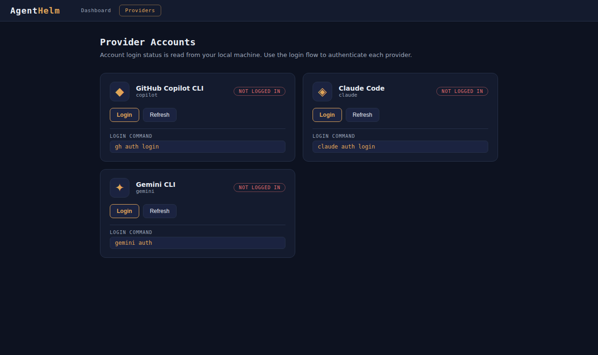

The **Providers** page shows which account each agent CLI on the Bridge's machine is logged in as, lets you run the login and logout commands from the browser, and lists the models GitHub Copilot offers you.

## Which providers appear

A card appears for each agent in the catalog whose `Id` is `copilot`, `claude` or `gemini` — AgentHelm knows where those three CLIs keep their login. Other agents, including the echo agent, have no card.

| Card | Status is read from | Login command | Logout command |
|---|---|---|---|
| GitHub Copilot CLI | `~/.config/gh/hosts.yml` — the GitHub CLI's (`gh`) signed-in user | `gh auth login` | `gh auth logout -h github.com --yes` |
| Claude Code | `~/.claude.json` — the OAuth account's e-mail | `claude auth login` | `claude auth logout` |
| Gemini CLI | `~/.gemini/settings.json` — the selected account's e-mail | `gemini auth` | `gemini auth logout` |

`~` is the home directory of the user running the Bridge. The status is **logged in** (with the account) or **not logged in**; **Refresh** reads the files again.

> **Note:** The Copilot card reports the **GitHub CLI** account. The Copilot CLI can have its own login (`copilot login`), so the card and the agent can disagree.

## Logging in and out

**Login** runs the card's login command on the Bridge's machine and streams its output into the card, line by line, ending with the exit code. Device-code flows — *open this URL and enter this code* — work well this way.

Logins that need an interactive terminal or open a browser on the Bridge's machine may not complete when run from the Bridge. In that case, run the same command in a terminal on that machine and click **Refresh**.

**Logout** runs the logout command and waits for it to finish. It is offered only when the card shows an account and a logout command is known.

## Copilot models

When `gh` is installed and signed in, the Copilot card lists the models from `gh api /copilot/models`, with the default marked ✓. The same list fills the **Model** drop-down in the new-session form. Without `gh`, the list is empty and the Model field is free text.

## Security

These actions execute the configured commands as the user running the Bridge, and the page reveals account e-mail addresses. Like every Bridge endpoint they are protected by the loopback bind and the optional API token — see the [security model](Security.md).
