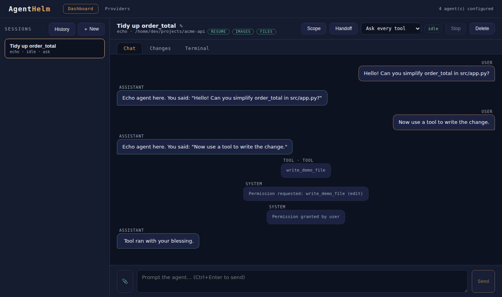

AgentHelm's UI has four pages: **My work**, the start page that lists your sessions by what needs you; **Sessions**, where you work with a session; **Search**, which finds sessions; and **Providers**, where you check the accounts of your agent CLIs. This page maps the interface; the pages that follow cover each feature in depth.



## Pages

| Page | Address | What it is |
|---|---|---|
| **My work** | `/` | The start page: live and archived sessions, grouped by state. |
| **Sessions** | `/sessions`, `/sessions/<id>` | The session rail on the left, the open session in the middle and the dock on the right. |
| **Search** | `/search` | Finds live and archived sessions by title, agent or transcript text. |
| **Providers** | `/settings` | The account status of the agent CLIs on the Bridge's machine. |

Each page has a top bar with links to the others. Only the Sessions page has the session rail and the dock; the other pages use the full width. The top bar on **My work** has no Search link, so reach Search from the Sessions page or open `/search`.

## UI overview

```
┌───────────────┬──────────────────────────────────────────┬─────────────────┐
│ « ▦ My work   │ Session title                            │  Dock           │
│   ⌕ Search    │ repo · cwd · model · chips  [mode] [st]  │  Changes│Term   ✕ │
│ Sessions    + │   [Changes] [Terminal] [Stop] [⋯]        │                 │
│  ▸ repo-a     │ ──────────────────────────────────────── │  diff of the    │
│     • sess 1  │                                          │  selected file, │
│  ▸ repo-b     │          Chat / transcript               │  or the shell   │
│ Chats       + │                                          │  (open only     │
│     • chat 1  │ ──────────────────────────────────────── │   when shown)   │
│ ⚙ Providers   │ 📎 [ prompt box ]                 [Send] │                 │
│ Feedback      │ [Interactive▾]  [model]                  │                 │
└───────────────┴──────────────────────────────────────────┴─────────────────┘
```

The diagram is simplified. The rail can be collapsed to icons, and the dock is closed until you open it.

## My work

The start page (`/`) lists live and archived sessions from one place. The filters are:

| Filter | Shows |
|---|---|
| **All** | Every session. |
| **Active** | Live sessions with a turn in progress (`running`). |
| **Needs attention** | Live sessions waiting for a permission decision, or whose last turn errored. |
| **Done** | Live sessions that are idle, plus archived sessions. |

Each live session falls into exactly one of Active, Needs attention or Done. **Cards** and **Table** switch the layout; the table shows title, agent, repository, status and last activity. Clicking a session opens it on the **Sessions** page. The list refreshes every few seconds.

## Sessions page

### Session rail (left)

| Element | What it does |
|---|---|
| **My work** / **Search** | Open the [My work](#my-work) and [Search](#search-page) pages. |
| **Sessions** heading | Labels the live list. **History** switches to archived sessions from PostgreSQL and **Live** switches back. See [History & resume](History-and-Resume.md). |
| **+** next to *Sessions* | Opens the **New session** dialog: agent, working directory, title, model. See [Starting a session](Sessions-and-Chat.md#starting-a-session). |
| Repository groups | Live sessions are grouped by repository (the last folder of their working directory). Click a group heading to collapse or expand it. |
| Session cards | One per live session: a status dot (copper = running, green = idle, red = error, grey = other), the title, then `agent · policy` where the policy reads `ask`, `auto-read` or `YOLO`, plus a ⏳ while a permission request is waiting for you. |
| **Chats** heading and **+** | **+** starts a [quick chat](Sessions-and-Chat.md#quick-chats): a session with no repository. Quick chats are listed under this heading, not among the repository groups. |
| **Providers** (footer) | Opens the [Providers](Provider-Accounts.md) page. |
| **Feedback** (footer) | Opens the project's GitHub issues in a new tab. |
| **«** / **»** (top) | Collapse the rail to icons only, and expand it again. |

The rail refreshes every three seconds; the open session itself updates live.

### Session header

| Element | What it does |
|---|---|
| Title | The session's title. Rename it from **⋯ › Rename**: <kbd>Enter</kbd> saves, <kbd>Esc</kbd> cancels. |
| Sub-line | The repository (last folder of the working directory), the working directory, the model when known, and capability chips (`resume`, `images`, `files`). |
| Mode chip | The session's permission mode: **Interactive**, **Plan** or **Autopilot**. It is shown here; change it under the composer. |
| Status | `idle`, or `running` while a turn is in progress. |
| **Changes** / **Terminal** | Open the dock on that panel. The pressed button shows which panel is open. |
| **Stop** | Enabled while the session runs. Asks the agent to cancel the current turn (ACP `session/cancel`). |
| **⋯** | The session menu: **Rename**, **Scope** (quality scores from [CopilotScope](CopilotScope-Integration.md) for this session's time window), **Handoff** (continue with another agent, see [Agent handoff](Agent-Handoff.md)) and **Delete**. |

**Delete** ends the session: it stops the agent and the terminal and deletes the session's history record.

## Banners and panels

Banners and panels appear between the header and the transcript when something needs you or when you open them:

- **Permission request** — the agent wants to run a tool; the buttons are the options the agent offered. See [Permissions & policies](Permissions-and-Policies.md).
- **YOLO confirmation** — shown when you pick Autopilot (YOLO), before anything changes.
- **Handoff** and **Scope** panels — opened from the **⋯** menu.

## Transcript and composer

The transcript and the composer are always in the main area. Under the prompt box:

- **📎** attaches files to the next prompt, and <kbd>Ctrl</kbd>+<kbd>Enter</kbd> or **Send** sends the prompt.
- **Mode** sets the permission policy: **Interactive** asks for every tool, **Plan** auto-allows reads, **Autopilot** allows everything after a confirmation. See [Permissions & policies](Permissions-and-Policies.md).
- The model box shows the model the session runs with, or *Default model*. It is read-only here; the model is chosen in the New session dialog.

## Dock (right)

**Changes** and **Terminal** open in a dock to the right of the transcript, side by side with the chat, so you can read a diff or run a command while you talk to the agent. The dock is available for live sessions; archived sessions are read-only and have no dock.

- Open it with the **Changes** or **Terminal** button in the header, or with the buttons on the closed dock's side rail.
- Switch panels with the tabs at the top of the dock.
- Drag its left edge to resize it (it cannot be narrower than 300 px).
- Use **✕** (*Hide panel*) to close it.
- AgentHelm remembers, per browser, whether the dock was open, which panel it showed and its width.

| Panel | What it shows |
|---|---|
| **Changes** | Uncommitted git changes in the working directory, with diff, accept and reject. See [Reviewing changes](Reviewing-Changes.md). |
| **Terminal** | Shells in the working directory, one per tab. See [Terminal](Terminal.md). |

## Keyboard

| Keys | Where | Action |
|---|---|---|
| <kbd>Ctrl</kbd>+<kbd>Enter</kbd> | Composer | Send the prompt |
| <kbd>Enter</kbd> / <kbd>Esc</kbd> | Title editor | Save / cancel the new title |
| <kbd>Enter</kbd> | Terminal input | Run the command |

## Search page

Type in the search box to filter live and archived sessions as you type. A session matches when its title or agent contains the text, or when any message in its transcript does; transcript matches show the surrounding text with the match highlighted. Select a result to open its session on the Sessions page. Archived results need PostgreSQL, like [History](History-and-Resume.md).

## Providers page

Lists the account status of the Copilot, Claude Code and Gemini CLIs on the Bridge's machine, with login and logout actions and — for Copilot — the available models. See [Provider accounts](Provider-Accounts.md).
