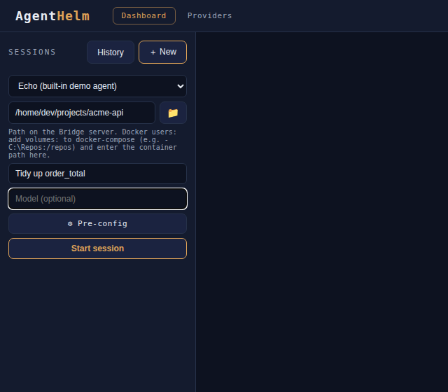
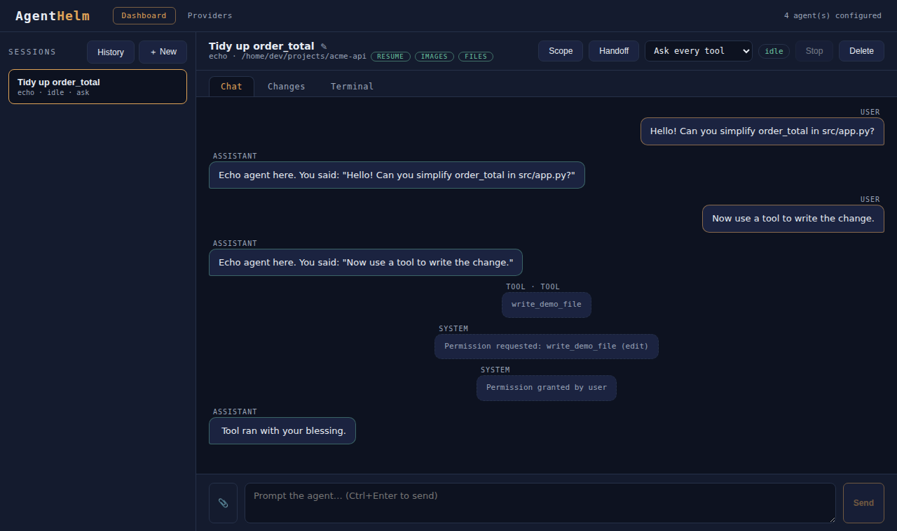

AgentHelm ships with a built-in **echo agent**: a tiny program that speaks the Agent Client Protocol just like a real agent. It needs nothing installed and lets you see the whole loop — prompt, streamed reply, permission request, audit trail — in about a minute.

## 1. Start a session

1. Open the UI (see [Installation](Installation.md) for the URL of your setup).
2. Click **＋ New** in the left rail.
3. Pick **Echo (built-in demo agent)**.
4. Enter a **working directory** — any directory that exists *on the machine running the Bridge*. The 📁 button opens a directory browser.
5. Optionally give the session a title, then click **Start session**.

The Bridge starts the echo agent as a child process in that directory, performs the ACP handshake, and the session opens. The header shows the agent, the working directory and **capability chips** — `resume`, `images`, `files` — that the agent advertised during the handshake.

> **Tip:** When you run from source, the catalog starts the echo agent with `dotnet run`, so the very first session takes a few seconds while it compiles.

## 2. Send a prompt

Type `Hello!` in the composer and press <kbd>Ctrl</kbd>+<kbd>Enter</kbd> (or **Send**). The reply streams in chunk by chunk — `Echo agent here. You said: "Hello!"` — and becomes a permanent transcript entry when the turn ends. The status badge in the header switches from `idle` to `running` and back.

## 3. Trigger a permission request

Send a prompt that contains the word **tool**, for example `Now use a tool to write the change.` The echo agent announces a tool call (`write_demo_file`, kind `edit`) and asks for permission to run it. An amber banner appears above the tabs with the options the agent offered — here **Allow** and **Reject**:

Notice the transcript: the request itself is already recorded as a system entry, *Permission requested: write_demo_file (edit)*. Click **Allow**. The decision is recorded as *Permission granted by user*, the agent carries on, and the turn ends:

Had you clicked **Reject**, the transcript would say *Permission denied by user* and the echo agent would answer *Tool was rejected — respecting that.* Either way the decision is part of the permanent record.

## 4. Try a different policy

The drop-down in the header is the session's **permission policy**. Switch it to **Auto-allow reads** and repeat the tool prompt: the echo agent's tool is an `edit`, not a read, so you are still asked. Switch to **YOLO** and AgentHelm asks you to confirm first; once enabled, the same request is allowed automatically and the transcript records *Permission auto-allowed by policy 'yolo': write_demo_file (edit)*. [Permissions & policies](Permissions-and-Policies.md) explains each policy.

## 5. Look around

- **Changes** — if the working directory is a git repository, the tab lists its uncommitted changes with a diff for each file. See [Reviewing changes](Reviewing-Changes.md).
- **Terminal** — a shell in the working directory. See [Terminal](Terminal.md).
- **History** — with PostgreSQL configured, past sessions are listed here and can be resumed. The echo agent supports resume. See [History & resume](History-and-Resume.md).

## Next steps

- Take the [tutorial](Tutorial.md) for a guided tour of everything else.
- [Connect a real agent](Connecting-Agents.md) — GitHub Copilot CLI, Claude Code or Gemini CLI.
